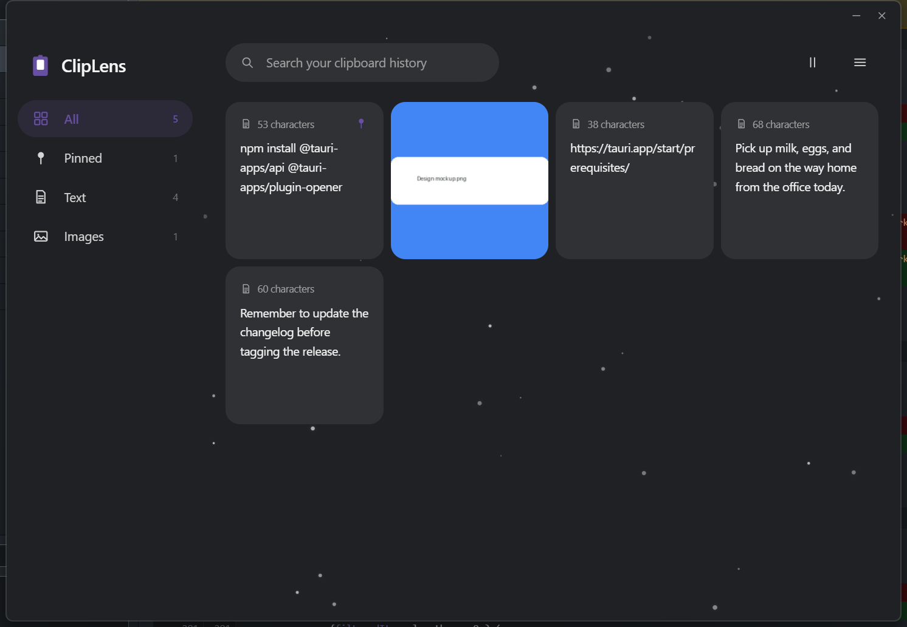
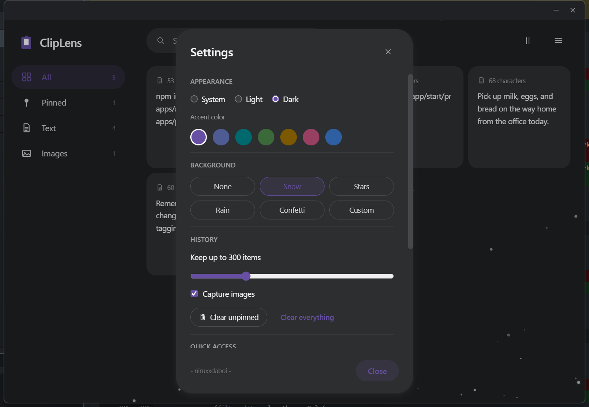

# ClipLens

A fast, minimal clipboard manager and history tracker for the desktop. ClipLens
runs quietly in the background, records everything you copy — text and images —
to a local SQLite database, and gets out of your way until you need it.

Built with [Tauri](https://tauri.app) (a Rust backend around a native OS
webview) and a React + TypeScript + [Tailwind CSS v4](https://tailwindcss.com)
frontend. No Electron, no cloud sync, no telemetry — your clipboard history
never leaves your machine.

Runs on **Windows, macOS, and Linux**.

## Screenshots

| History | Settings |
|---|---|
|  |  |

## Features

**Capture & browse**
- Automatic capture of every text or image copy while ClipLens runs.
- Persistent history in a local SQLite database — survives restarts.
- Image copies are thumbnailed and stored alongside the full-size original.
- Sidebar navigation across All, Pinned, Text, and Images, each with a live count.
- A responsive masonry grid (1–3 columns depending on window width) instead of one long list.
- Search box to filter history by text content.

**Acting on an item**
- One-click copy back — click any card to put it back on the clipboard, with an animated confirmation (an accent-colored ring flash and a checkmark badge pop over the card, plus a springy toast).
- Pin important items to keep them at the top, exempt from auto-cleanup.
- Delete individual items, or clear unpinned / everything at once.

**Living in the background**
- Pause monitoring temporarily (e.g. before copying a password).
- System tray icon: closing the window hides it to the tray instead of quitting; monitoring keeps running.
- Launch on boot, with an option to start minimized to the tray.
- A configurable history limit — oldest unpinned items are pruned automatically.

**Look & feel**
- Flat light/dark themes built from a chosen accent color, with light/dark/system modes.
- Custom frameless window with its own title bar, centered on screen with a fade-in/fade-out animation.
- Settings open in an animated modal (fade + spring-scale in and out).
- Secondary actions (Settings, autostart, clear-history, quit) are tucked behind a hamburger menu — the header only ever surfaces search and pause/resume.

## Requirements

- [Node.js](https://nodejs.org) 18+ and npm
- [Rust](https://www.rust-lang.org/tools/install) (stable) + Cargo
- Platform build tools for Tauri — see the [Tauri prerequisites guide](https://tauri.app/start/prerequisites/):
  - **Windows**: the MSVC "Desktop development with C++" workload (Visual Studio Build Tools)
  - **macOS**: Xcode Command Line Tools
  - **Linux**: WebKitGTK and friends (see the guide for your distro's package names)

### Platform notes

| Feature | Windows | macOS | Linux |
|---|---|---|---|
| Clipboard read/write (text + images) | [`arboard`](https://github.com/1Password/arboard) | `arboard` | `arboard` (needs an X11 or Wayland session) |
| Launch on boot | `HKCU...\Run` registry key | `~/Library/LaunchAgents` LaunchAgent | `~/.config/autostart` XDG `.desktop` entry |
| System tray | works out of the box | works out of the box | needs a tray host in your desktop environment (most have one; some minimal window managers don't) |

All three platforms share the same Rust code paths — [`arboard`](https://github.com/1Password/arboard)
for clipboard access, [`tauri-plugin-autostart`](https://github.com/tauri-apps/plugins-workspace)
for launch-on-boot, and Tauri's native tray — so there are no per-OS subprocess
tools (AppleScript/xclip/wl-copy) needed for image copy-back.

## Getting started

```bash
npm install
npm run tauri dev
```

`npm run tauri dev` starts the Vite dev server and a debug build of the app
with hot reload for the frontend (Rust changes still require a restart).

### Building a release

```bash
npm run tauri build
```

Produces a release binary and platform installer(s) under
`src-tauri/target/release/` (e.g. `bundle/msi` and `bundle/nsis` on Windows).
To start hidden in the system tray (used by the autostart entry), pass
`--minimized` to the built executable.

The app keeps running in the tray after the window is closed — the close
button hides it rather than exiting. Use **Quit ClipLens** from the tray
menu or the hamburger menu to actually stop it.

## Launch on boot

Open the hamburger menu (top-right) and toggle **Start with Windows** (label
follows the OS), or open **Settings…** for the same toggle alongside **Start
minimized to tray** (so manual launches from a shortcut start hidden too).
This uses [`tauri-plugin-autostart`](https://github.com/tauri-apps/plugins-workspace)
to write a per-user startup entry:

- **Windows**: a value under `HKEY_CURRENT_USER\Software\Microsoft\Windows\CurrentVersion\Run`.
- **macOS**: a LaunchAgent plist at `~/Library/LaunchAgents/com.cliplens.app.plist` (takes effect on next login).
- **Linux**: an XDG autostart entry, picked up by GNOME, KDE, XFCE, and most other desktop environments.

## Data storage

ClipLens stores its data in Tauri's per-app data directory (identifier
`com.cliplens.app`):

| OS | Path |
|---|---|
| Windows | `%APPDATA%\com.cliplens.app` |
| macOS | `~/Library/Application Support/com.cliplens.app` |
| Linux | `~/.local/share/com.cliplens.app` |

Contents:

- `history.db` — SQLite database of clipboard entries
- `images/` — full-size PNGs and thumbnails for image clips
- `settings.json` — app preferences

Deleting this folder resets ClipLens to a clean state.

## Troubleshooting

**The window is briefly blank/white on launch.** This is a known WebView2
quirk on Windows: a window that goes from hidden to visible can come up fully
un-painted until an input event reaches it. ClipLens works around this by
synthesizing a click right after showing the window (see
`src-tauri/src/winfocus.rs`); if you still see it, it should resolve itself
the moment you click anywhere in the window.

**`cargo build` fails linking on Windows.** Make sure the MSVC "Desktop
development with C++" workload is installed, and prefer a plain PowerShell/cmd
prompt over Git Bash for Rust builds — Git for Windows ships its own
`link.exe` that can shadow the real MSVC linker on `PATH`.

## Project layout

```
src-tauri/                     Rust backend
  src/
    lib.rs                       app setup: plugins, window/tray lifecycle
    main.rs                      entry point
    commands.rs                  #[tauri::command]s exposed to the frontend
    db.rs                        SQLite schema and CRUD (clip_items table)
    settings.rs                  persisted Settings struct (settings.json)
    clipboard.rs                 arboard-based clipboard read/write + hashing
    monitor.rs                   background thread that polls the clipboard
    tray.rs                      system tray icon + menu
    winfocus.rs                  Windows-only: foreground focus + repaint nudge
  tauri.conf.json                window chrome, identifier, asset protocol scope
  capabilities/default.json      frontend IPC permissions

src/                           React + TypeScript frontend
  App.tsx                        root layout; owns history/search/filter state
  components/
    TitleBar.tsx                  drag region + minimize/close
    Sidebar.tsx                    All / Pinned / Text / Images navigation
    Header.tsx                    search, pause/resume, hamburger menu
    ClipCard.tsx                   one history card (text/image, pin, delete, copy animation)
    EmptyState.tsx
    SettingsDialog.tsx             Appearance / History / Startup, animated open/close
    ResizeHandles.tsx              edge/corner drag-to-resize
    Toast.tsx                      animated confirmation toast
    icons.tsx                      small hand-rolled SVG icons
  lib/
    api.ts                        typed invoke()/listen() wrappers
    theme.ts                      resolves theme_mode + accent -> CSS vars
    format.ts                     time/text formatting helpers
  types.ts                       ClipItem/Settings interfaces mirroring Rust
  index.css                      Tailwind v4 entry, class-based dark mode, keyframe animations
```
